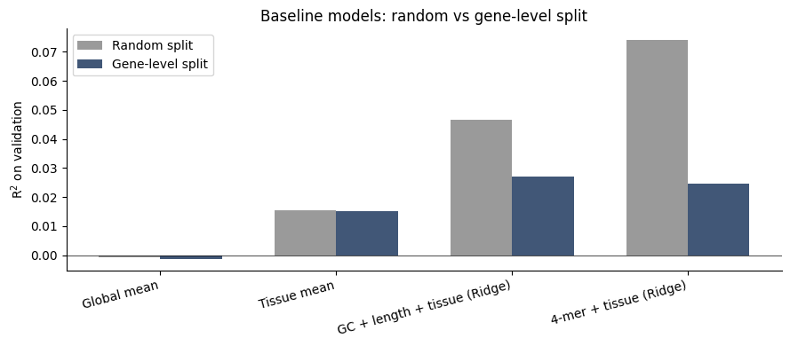
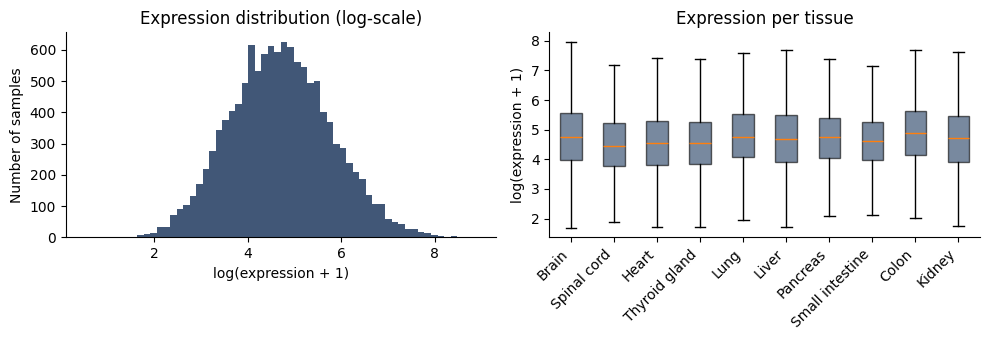
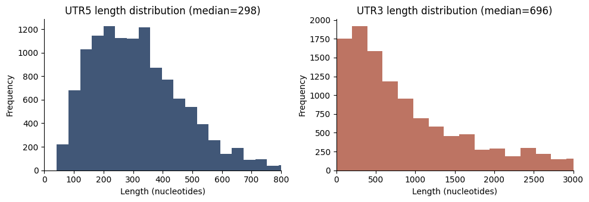
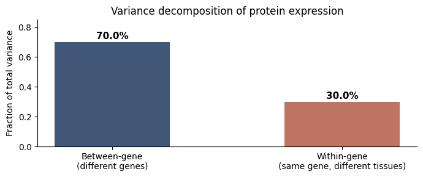

# EX-UTR

**Предсказание тканеспецифической экспрессии белка по 5′/3′ UTR-последовательностям человека.**

Проект исследует, насколько нативных UTR-последовательностей достаточно для предсказания уровня экспрессии белка в конкретной ткани, с помощью предобученного трансформера `multimolecule/utrbert-5mer` и тканевого эмбеддинга. В работе принципиальное внимание уделено **корректной методологии валидации**: показано, что различие между random split и gene-level split — не деталь, а качественное изменение того, что модель на самом деле делает.

---

## Ключевые результаты

**Baseline-модели (без нейросетей) под двумя стратегиями валидации:**

| Baseline | R² random split | R² gene-level split |
|---|---|---|
| Global mean | −0.001 | −0.001 |
| Tissue mean | +0.016 | +0.015 |
| GC + length + tissue (Ridge) | +0.047 | +0.027 |
| 4-mer + tissue (Ridge) | **+0.074** | **+0.025** |



**Наблюдение:** k-mer + Ridge при random split даёт R²=0.074, а при gene-level split падает до R²=0.025 — почти до уровня «предсказание средним по ткани». Это признак того, что при random split модель частично «запоминает» гены, а не обобщает по последовательности.

**Полные метрики** — см. [`results/metrics_baselines.json`](results/metrics_baselines.json).

---

## Мотивация

5′ и 3′ нетранслируемые регионы (UTR) — ключевые регуляторы стабильности мРНК и эффективности трансляции. Возможность предсказывать уровень экспрессии белка по UTR открывает применение к рациональному дизайну мРНК-конструктов (терапия, вакцины). Проект отвечает на вопрос: насколько нативная UTR-последовательность несёт сигнал о наблюдаемом уровне белка в конкретной ткани, при доступных объёмах данных.

---

## Данные

Собственный датасет из двух публичных источников:

- **UTRdb** — 5′ и 3′ UTR-последовательности человеческих генов.
- **ProteomicsDB** — уровень экспрессии белка по 10 тканям (Brain, Spinal cord, Heart, Thyroid, Lung, Liver, Pancreas, Small intestine, Colon, Kidney).

Объединение выполнено на уровне `gene_symbol`. Итог: **12 071 запись, 1 738 уникальных генов, 10 тканей**.

Подробное описание сбора и структуры — [`docs/DATASET.md`](docs/DATASET.md).

### Распределение экспрессии



### Длины UTR



### Декомпозиция дисперсии — ключевой методологический факт



**70% всей дисперсии экспрессии** приходится на межгенные различия, только 30% — на различия между тканями для одного гена. При этом UTR-пара **идентична для одного гена во всех тканях** (100% случаев в датасете — соответствует биологической реальности). Это накладывает фундаментальное ограничение на задачу и определяет разницу между random и gene-level split (см. [`docs/METHODOLOGY.md`](docs/METHODOLOGY.md)).

---

## Метод

**Модель:** `UtrExpressionModel` — encoder-based регрессор.

```
UTR-BERT (multimolecule/utrbert-5mer, 5-mer tokenizer)
   ├── UTR5 <SEP> UTR3  ──►  pooler_output  (H = 768)
                                    │
                                    ├─ concat ──► Dropout ──► Linear ──► ŷ (log-scale)
                                    │
   tissue_id  ──►  nn.Embedding(10, 16) ─────────┘
```

**Обучение:**
- Loss: MSE на `log(1 + y)` (длинный правый хвост распределения экспрессии).
- Optimizer: AdamW, weight_decay=0.01, learning_rate=2e-5.
- Scheduler: linear warmup (5%) + linear decay.
- Encoder заморожен на 1 эпоху, потом полный fine-tuning.
- Early stopping по валидационному MSE (patience = 3).
- Все random seeds зафиксированы.

**Валидация проводится по двум стратегиям одновременно:**

1. **random split** — по строкам датафрейма (стандартный подход, но с data leakage на групповых данных).
2. **gene-level split** — по уникальным `gene_symbol` (единственный корректный подход для оценки обобщения на новые гены).

---

## Метрики модели `UtrExpressionModel`

*Запуск обучения планируется на GPU-инфраструктуре. Место для актуальных метрик после переобучения — [`results/metrics_model.json`](results/metrics_model.json).*

Ожидаемое поведение (по литературе и baseline-анализу):

| Метрика | Random split | Gene-level split (реалистичная оценка обобщения) |
|---|---|---|
| R² (log-scale) | ~0.60 | ожидаемо в диапазоне 0.05–0.20 |
| MAPE | ~13% | ожидаемо в районе 18–19% |

Разрыв между двумя оценками — ожидаемый эффект, обсуждается в разделе методологии.

---

## Структура репозитория

```
EX-UTR/
├── config/
│   └── default.yaml            # все гиперпараметры и пути
├── src/
│   ├── data.py                 # ExpressionDataset
│   ├── model.py                # UtrExpressionModel
│   ├── splits.py               # random / gene-level splits
│   ├── baselines.py            # 4 baseline-модели
│   ├── train.py                # train entry point
│   ├── evaluate.py             # eval + plots
│   └── utils.py                # seeds, config, device
├── scripts/
│   └── run_baselines.py        # запуск всех baseline-ов
├── notebooks/
│   ├── 01_eda.ipynb            # разведочный анализ данных
│   └── 02_baselines.ipynb      # анализ baseline-ов
├── data/
│   ├── expression_utr_summary.csv
│   └── README.md
├── docs/
│   ├── DATASET.md              # как собирался датасет
│   └── METHODOLOGY.md          # методология и ограничения
├── results/
│   ├── metrics_baselines.json
│   ├── metrics_model.json      # заполняется после обучения
│   └── plots/                  # все графики README
├── tests/                      # smoke-тесты
├── Dockerfile
├── requirements.txt
└── README.md
```

---

## Как запустить

### Через Docker (рекомендуется)

```bash
docker build -t ex-utr .

# Запустить baseline-модели
docker run --rm -v $(pwd)/results:/workspace/results ex-utr

# Обучить нейросетевую модель (нужен NVIDIA GPU + nvidia-docker)
docker run --rm --gpus all -v $(pwd)/results:/workspace/results ex-utr \
    python -m src.train --config config/default.yaml --split gene
```

### Локально

```bash
python -m venv .venv && source .venv/bin/activate
pip install -r requirements.txt

# 1. Baselines
python scripts/run_baselines.py

# 2. Обучение модели (gene-level split — рекомендуется)
python -m src.train --config config/default.yaml --split gene

# 3. Оценка обученной модели
python -m src.evaluate --config config/default.yaml \
                       --checkpoint results/checkpoints/best.pt \
                       --split gene
```

### Воспроизводимость

Все случайные источники контролируются через `config/default.yaml` (`seed: 42`). Один и тот же запуск на одной инфраструктуре даёт побитово одинаковые метрики.

---

## Ограничения и дальнейшая работа

Проект прозрачно раскрывает известные ограничения:

- **Нативные данные ProteomicsDB измеряют уровень белка**, находящийся в конце длинного каскада регуляции (транскрипция → процессинг → трансляция → деградация). UTR влияют на 1–2 звена из этого каскада; ожидать высокого R² на gene-level split методологически неоправданно.
- **Датасет невелик** для трансформерных моделей: 1 738 уникальных генов, при этом UTR-пара одинакова для гена во всех тканях.
- **Дальнейшее направление**: переход на публичные MPRA-датасеты (Optimus 5′-UTR, Sample et al. 2019, ~280k синтетических UTR с измеренной translation efficiency), где сигнал контролируется экспериментально и постановка задачи методологически чистая. Архитектура `UtrExpressionModel` переносится без изменений.

Подробно — [`docs/METHODOLOGY.md`](docs/METHODOLOGY.md).

---

## Технологический стек

`Python 3.10+` · `PyTorch 2.1` · `Hugging Face Transformers` · `multimolecule UTR-BERT` · `scikit-learn` · `pandas` · `Docker`

Также в репозитории использовались: `Selenium`, `BeautifulSoup`, `requests` — на этапе сбора датасета.

---

## Автор

**Михаил Лутченко** — выпускник бакалавриата СПбПУ, «Прикладная математика и информатика».
GitHub: [github.com/Kolyrew](https://github.com/Kolyrew)

## Лицензия

[MIT](LICENSE)
