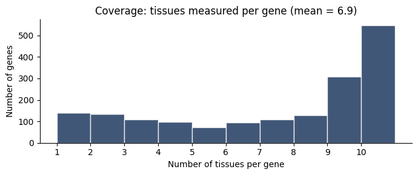

# Датасет EX-UTR

Собственный датасет, объединяющий UTR-последовательности с уровнями экспрессии белка по 10 тканям человека.

## Источники

| Источник | Что извлекалось | Технология |
|---|---|---|
| [UTRdb](https://utrdb.cloud.ba.infn.it/) | 5′ и 3′ UTR-последовательности человеческих генов, привязанные к `gene_symbol` | Selenium (страницы с JS-загрузкой) + JSON/regex парсинг |
| [ProteomicsDB](https://www.proteomicsdb.org/) | Уровень экспрессии белка по 10 тканям, привязанный к `gene_symbol` | `requests` + `BeautifulSoup` для статических эндпоинтов |

Скрипты сбора находятся в `Parsers/` (не входят в основной пайплайн, приложены для воспроизводимости).

## Объединение

Слияние выполняется по колонке `gene_symbol` (стандартный HGNC-идентификатор). Для одного гена:
- UTR5 и UTR3 идентичны во всех тканях (100% случаев — это соответствует биологической реальности, UTR — участок ДНК).
- Уровень экспрессии белка различается по тканям.

## Итоговая структура

Файл: `data/expression_utr_summary.csv`
Формат: CSV, разделитель — запятая, encoding UTF-8.

| Колонка | Тип | Описание |
|---|---|---|
| `Gene_ID` | str | Внутренний ID гена |
| `gene_symbol` | str | HGNC-символ гена |
| `UTR5_Sequence` | str | 5′ UTR (буквы A/C/G/T) |
| `UTR3_Sequence` | str | 3′ UTR (буквы A/C/G/T) |
| `tissue` | str | Одна из 10 тканей |
| `expression_level` | float | Уровень экспрессии белка (log-scale, из ProteomicsDB) |

## Статистика

- **Записей**: 12 071
- **Уникальных генов**: 1 738
- **Тканей**: 10 (Brain, Spinal cord, Heart, Thyroid gland, Lung, Liver, Pancreas, Small intestine, Colon, Kidney)
- **Среднее число тканей на ген**: 6.9 (не все гены измерены во всех тканях)
- **Распределение `expression_level`**: диапазон [0.53, 8.90], среднее ≈ 4.71, σ ≈ 1.08

### Ковровое покрытие тканей на ген

## Декомпозиция дисперсии

Один из ключевых фактов о датасете (важно для интерпретации результатов):

- **Between-gene variance** (насколько разные гены отличаются по среднему уровню экспрессии): **70%** общей дисперсии.
- **Within-gene variance** (насколько один и тот же ген варьируется по тканям): **30%**.

Эти 30% within-gene variance **по определению не могут быть предсказаны по UTR**, так как UTR-пара одна и та же для всех тканей одного гена. Их может «предсказать» только тканевой контекст.

Оставшиеся 70% — межгенные различия, и вот их модель может пытаться предсказать по UTR-последовательности. Насколько успешно — тема результатов проекта.

## Ограничения датасета

1. **Малый размер по меркам DL**: 1 738 уникальных генов — на порядок меньше, чем в успешных проектах предсказания экспрессии по последовательностям (MPRA-датасеты содержат 100–500 тыс. последовательностей).
2. **Уровень белка, а не мРНК**: ProteomicsDB измеряет протеом. От UTR до уровня белка — 4–5 регуляторных слоёв (транскрипция, процессинг, экспорт, трансляция, деградация), из которых UTR влияет на 1–2. Сигнал сильно разбавляется.
3. **Одна UTR-пара на ген**: невозможно изучать, как локальные изменения UTR меняют экспрессию. Для этого нужны MPRA-эксперименты с синтетическими вариантами.

Эти ограничения обсуждаются подробнее в [`METHODOLOGY.md`](METHODOLOGY.md), включая направление доработки — переход на публичные MPRA-датасеты.
